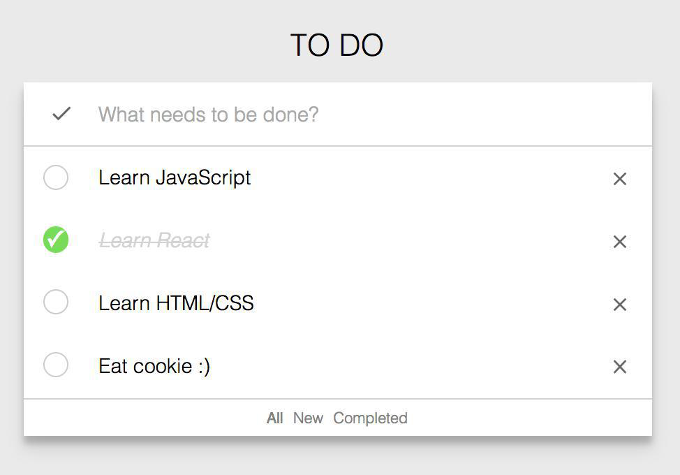
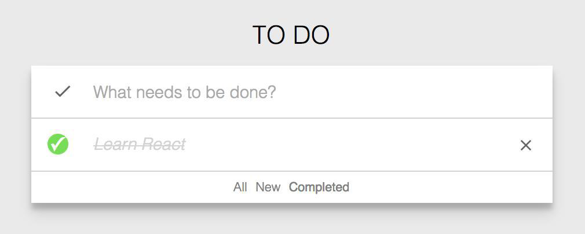

## Список задач (Todo-list)

 - Галочка сверху отмечает все задачи в списке как выполненные, их можно удалять.
 
 - Реализована отправка событий о добавлении задач (удалении, вычеркивании) в Гугл Аналитику (https://www.google.com/analytics/).

 - Сделана синхронизация списка задач с localStorage c использованием собственного middleware.

 - Есть меню с возможностью фильтрации заметок (All, New, Completed)

