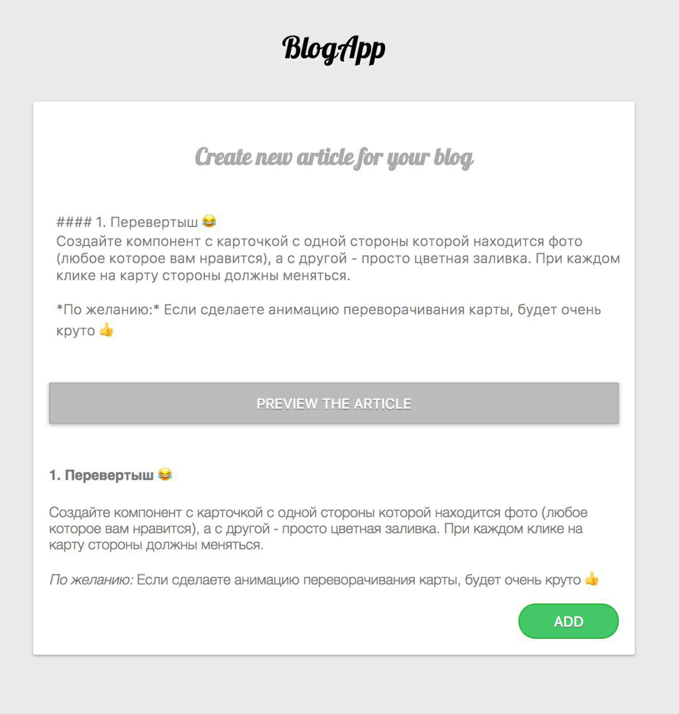

## Блог
 
**Форма для создания новой статьи**
 
 При нажатии на кнопку "Add", статья появляется в списке статей на странице.
 
 Текст статьи поддерживает форматировние Markdown. 
 Для процессинга Markdown используется библиотека [Remarkable](https://github.com/jonschlinkert/remarkable).
 
 Для формы создания статьи используется Live Preview.
 Есть возможность удаления статьи из списка.
 
 
 
 
 
 