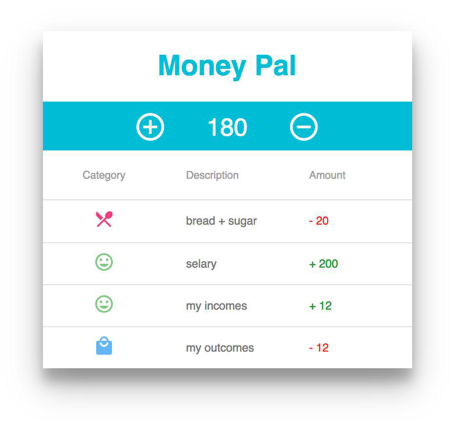
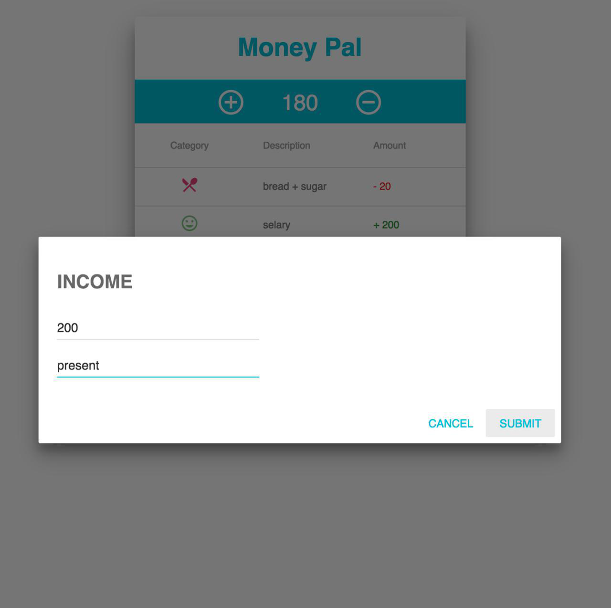
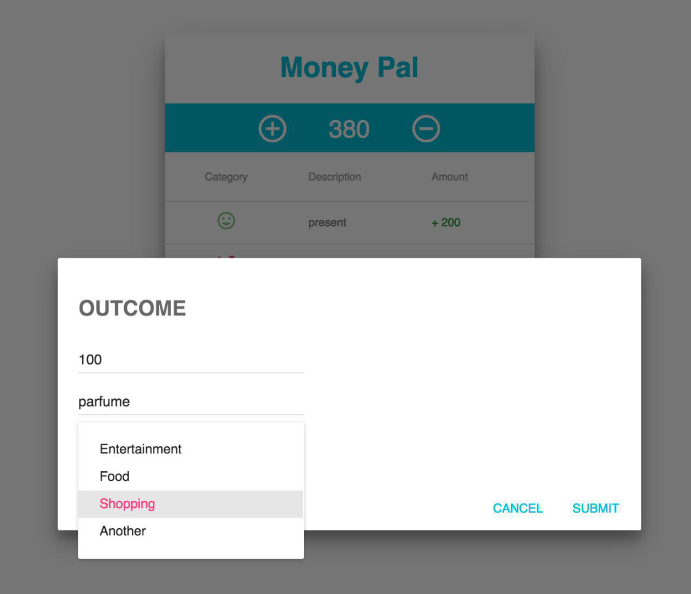

#### 2. Приложение для учета расходов

Список доходов и расходов.

Можно добавлять свои доходы (сумма, название) и расходы (сумма, название, категория).

Предусмотрено 4 категории для расходов - развлечения, еда, покупки и другое.

Вверху всегда виден текущий баланс.

Используется библиотека компонентов Material UI, React ES6 синтаксис и СSS Modules.

 