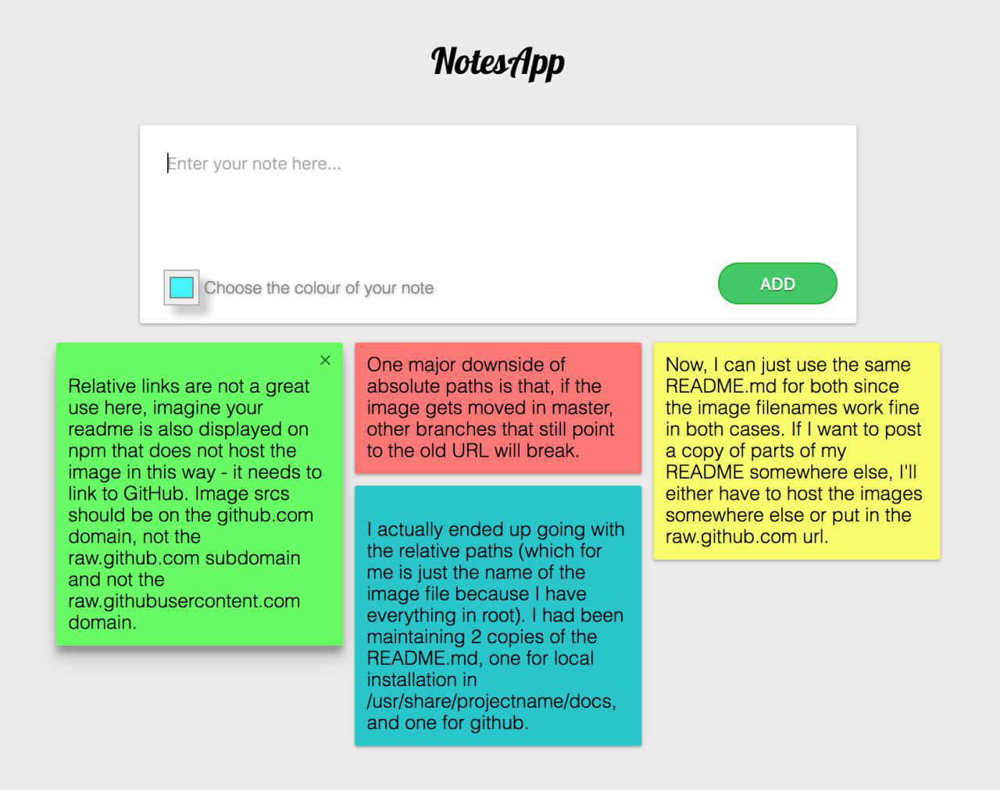

## Заметки
 
**Выбор цвета для заметки**
 
 При нажатии на кнопку "Add", статья появляется в списке статей на странице.
 Список заметок отображается с помощью masonry.
  
 При создании новой заметки можно выбирать ее цвет из всего спектра.

 Есть возможность удаления заметки. 
 
 
 