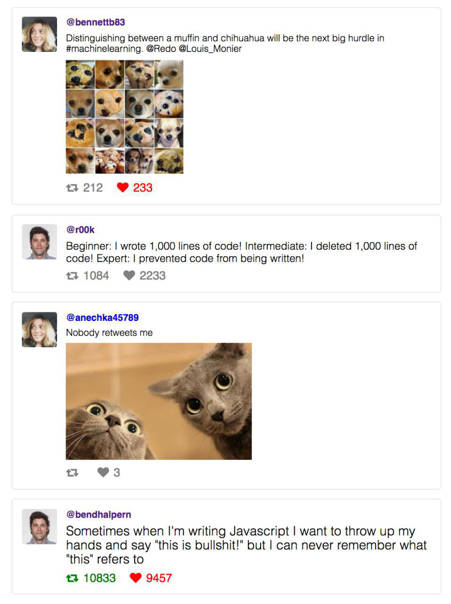

## Компонент для отображения твитов
 
 1) Соответствующие иконки в твите подсвечиваются в зависимости от того, твит был liked или retweeted.
 2) В зависимости от количества лайков и ретвитов, изменяется размер текста в твите.
 
 
 